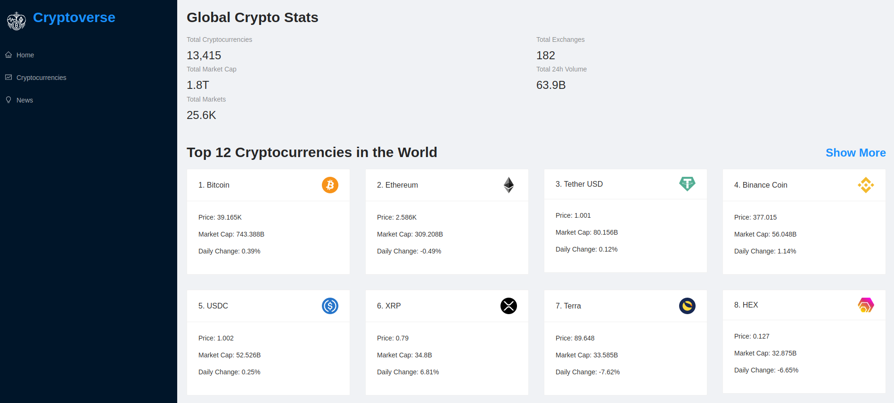

# Showing stats and news about crypto currencies

> React app

## Description

In this task, you will be working with the real live data from the SpaceX API. Your task is to build a web application for a company that provides commercial and scientific space travel services. The application will allow users to book rockets and join selected space missions.

## Built With

- Major languages: Javascript
- Frameworks: React.js, Redux
- Technologies used: Node.js, Babel, webpack
- Tested with: - ESLint (JavaScript linting), Stylelint (style linting) Jest (React snapshot testing)

## Live Demo

[Live demo](https://yuriy-cryptoverse.netlify.app/)

### Deployment

With [Netlify](https://www.netlify.com/)

## Author

👤 **Yuriy Chamkoriyski**

- GitHub: [@Hombre2014](https://github.com/Hombre2014)
- Twitter: [@Chamkoriyski](https://twitter.com/Chamkoriyski)
- LinkedIn: [axebit](https://linkedin.com/in/axebit)

## 🤝 Contributing

Contributions, issues, and feature requests are welcome!

Feel free to check the [issues page](https://github.com/Hombre2014/Cryptoverse/issues).

## Show your support

Give a ⭐️ if you like this project!

## Acknowledgments

## 📝 License

This project is [MIT](./license.md) licensed.